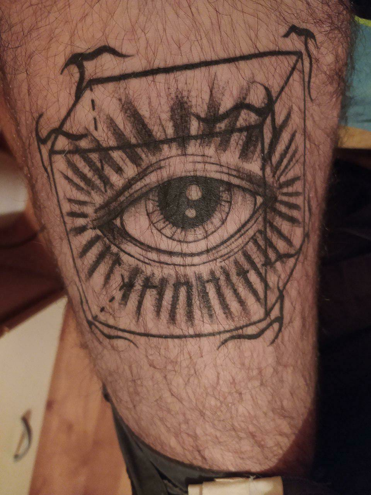
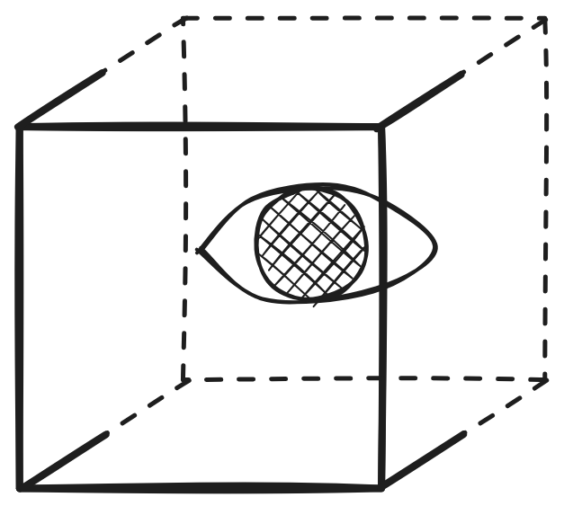
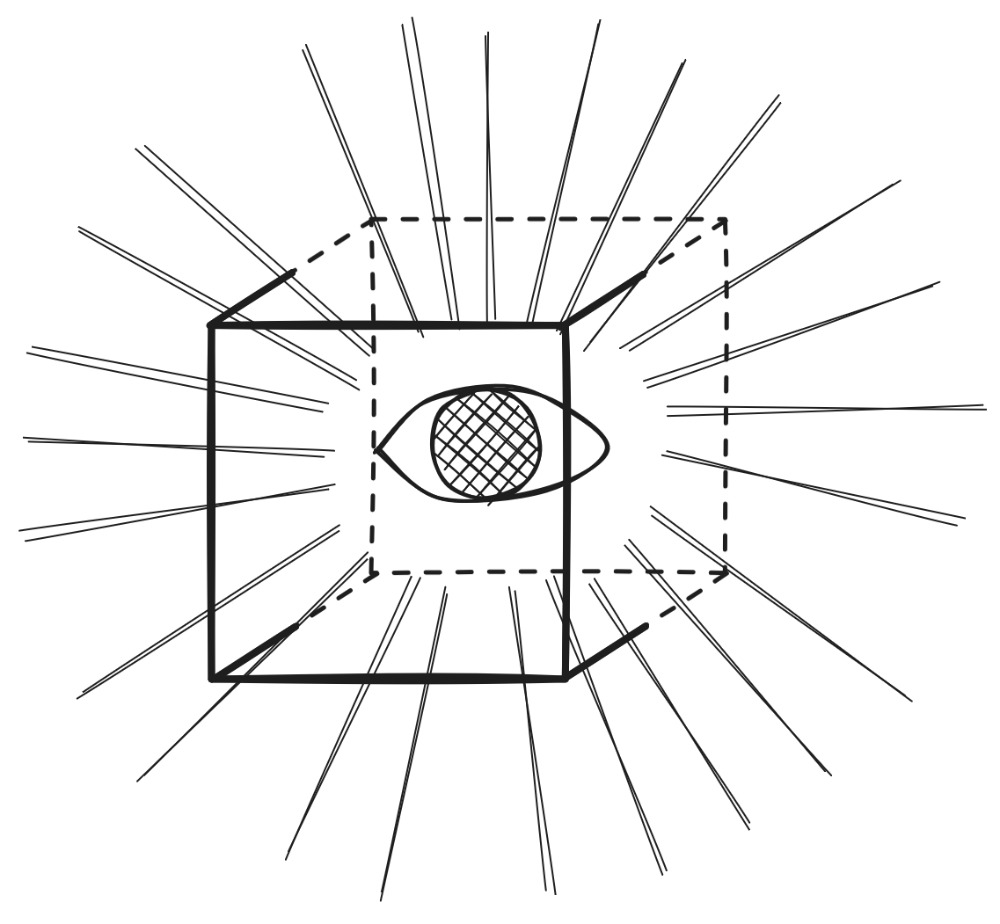
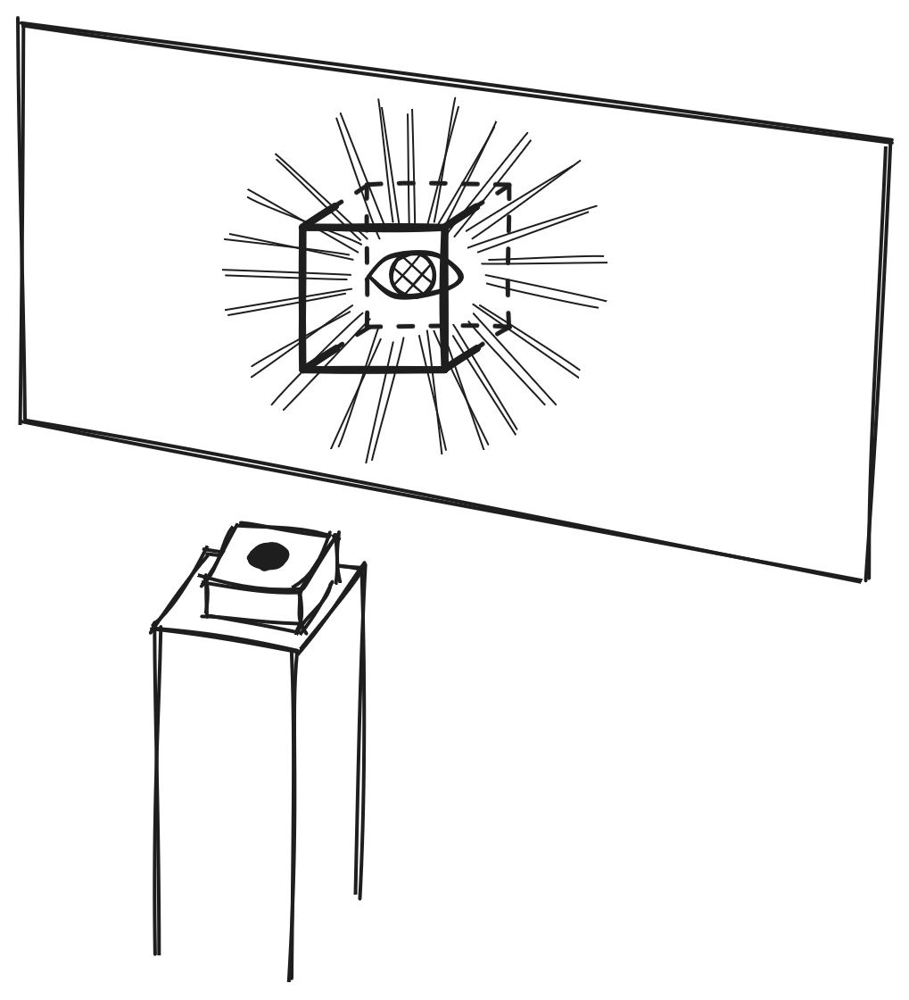

ispirata da un tatuaggio del mio amico giacomo:

ispirato alla filosofia del [solipsismo](solipsismo.md), che ha portato jay per un periodo a immaginarsi che tutto quello dietro di lui, fuori dal suo campo visivo, non esistesse e venisse costruito su misura ogni volta che viene osservato

il tatuaggio rappresenta un occhio dentro a un cubo, in cui i nove spigoli davanti sono linee solide, mentre i tre spigoli dietro sono tratteggiati, perché dietro all'occhio e fuori dal suo campo visivo.

illustrazioni con soggetto simile (le ho fatte io!)

## mia idea
un televisore, con dentro l'occhio e il cubo renderizzati in real time (ho in mente sempre questo stile bianco-nero con linee fatte finte a mano + shader foglio di carta) + una serie di altre illustrazioni dinamiche 

tramite una periferica hardware (una manopola? una leva?) lo spettatore può spostare l'occhio, e di conseguenza rendere solide o tratteggiate alcune linee

