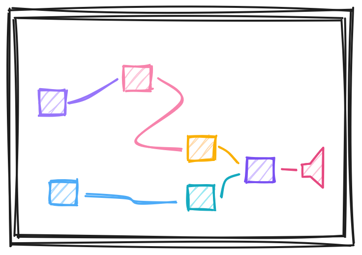
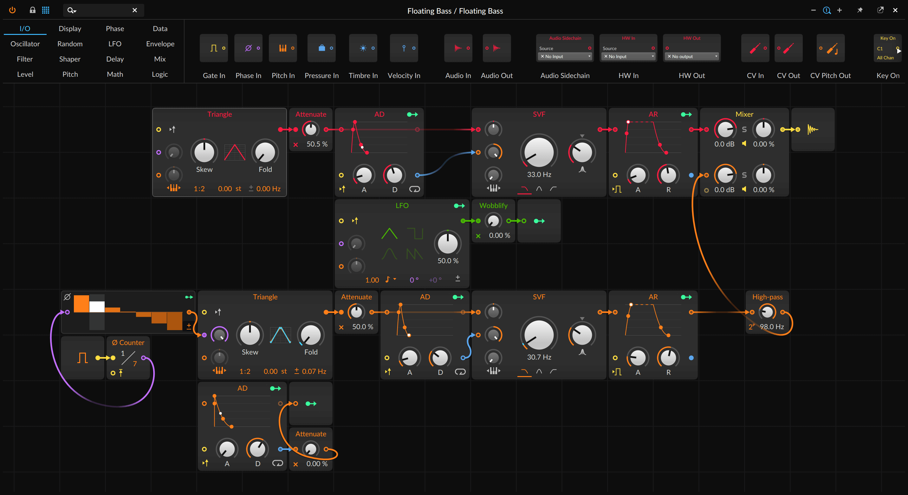
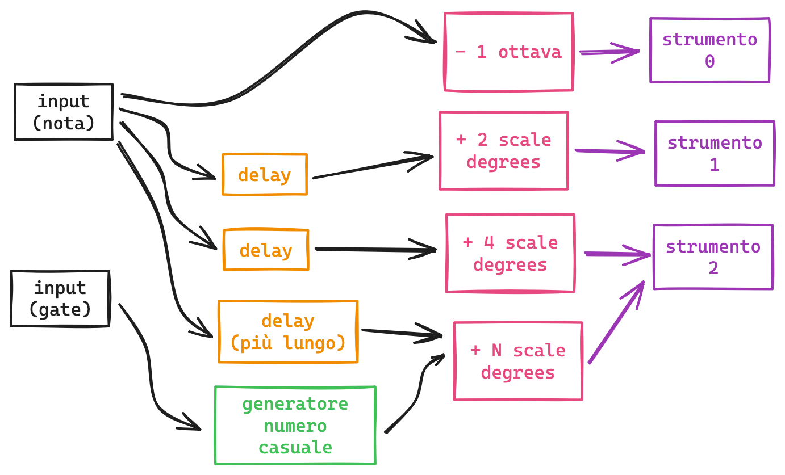

ui simil-plugdata (tutta da zero, ma fortemente ispirata alla grid di bitwig), che contiene moduli collegati tra di loro che manipolano informazioni su note e accordi e scale

la ui può essere manipolata con un touchscreen dall'utente oppure generata randomicamente ogni volta che l'utente preme un pulsante.

idee per l'interfaccia hardware (se non c'è un touchscreen)
* pulsante "randomizza completamente"
* tastiera per inserire una o più note in input (risultato viene riprodotto in tempo reale)
* encoder per selezionare un modulo + pulsante toggle attivo/bypassato

