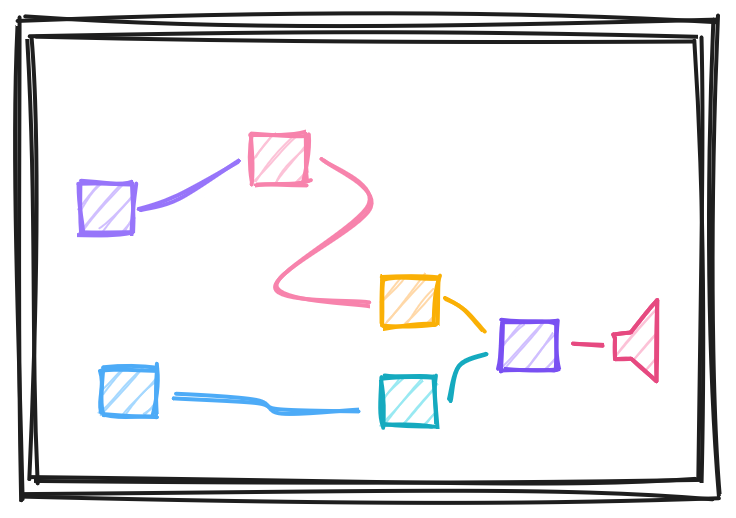
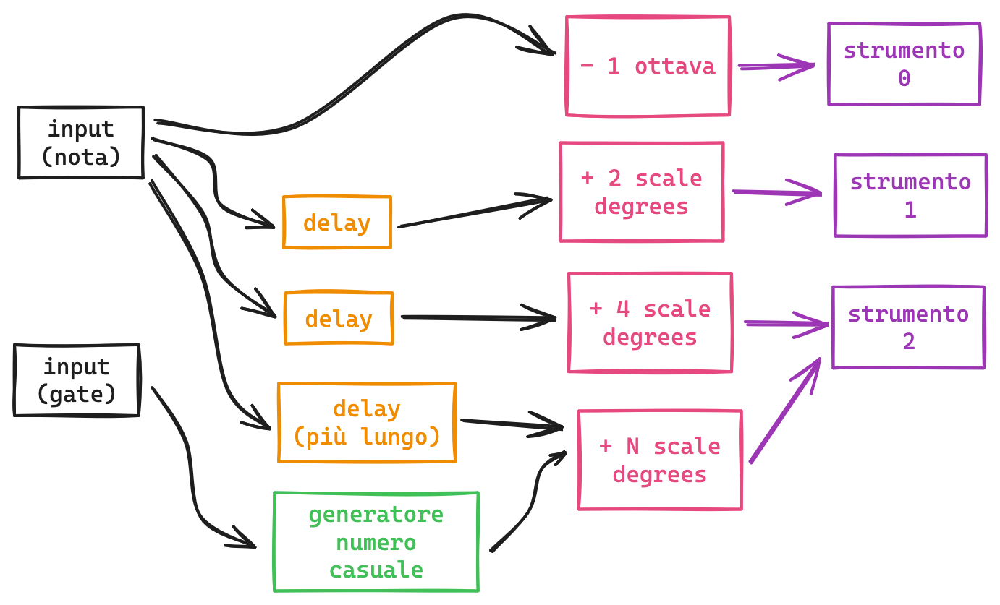

ui simil-plugdata (tutta da zero, ma fortemente ispirata alla grid di bitwig), che contiene moduli collegati tra di loro che manipolano informazioni su note e accordi e scale

la ui può essere manipolata con un touchscreen dall'utente oppure generata randomicamente ogni volta che l'utente preme un pulsante.

## idee per l'interfaccia hardware (se non c'è un touchscreen)
* pulsante "randomizza completamente"
* tastiera per inserire una o più note in input (risultato viene riprodotto in tempo reale)
* encoder per selezionare un modulo + pulsante toggle attivo/bypassato

## idee per moduli
### input
* input nota (pitch)
* input gate (boolean)
* tempo trascorso dall'ultima nota suonata (numero)

### routing
* selettore sposta un input su uno degli output
* selettore sceglie uno tra gli input da mandare in output

### trasformazione
* valore random (vero random)
* valore random (distribuzione normale)
* operazioni aritmetiche

### trasformazione pitch
* trasposizione
  * semitoni
  * scale degrees
* quantizzazione verso una certa scala
* "specchio" attorno a una nota base o attorno al cerchio delle quinte

### trasformazione nel tempo
* delay

### output
penso due o tre moduli sempre fissi, con tre possibili voci (synth, sampler, quello che sarà)

## altre idee
avere come controller un "chord generator" che segue le regole dell'armonia tonale come [questo][nopia]

parti importanti della ui di questo device:

parti che si possono aggiungere
* "temperatura" (probabilità di scegliere occasionalmente note dissonanti)
* capacità di interscambio modale
* vari parametri dei synth
* looper

[nopia]: https://www.youtube.com/watch?v=Ivuy9QYLFVY&t=223s