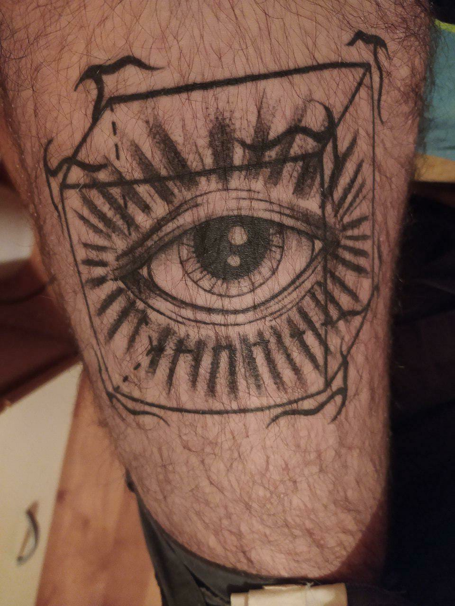
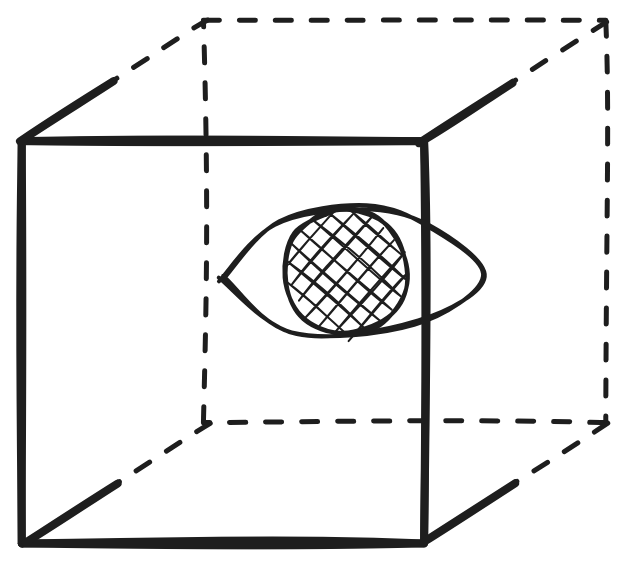
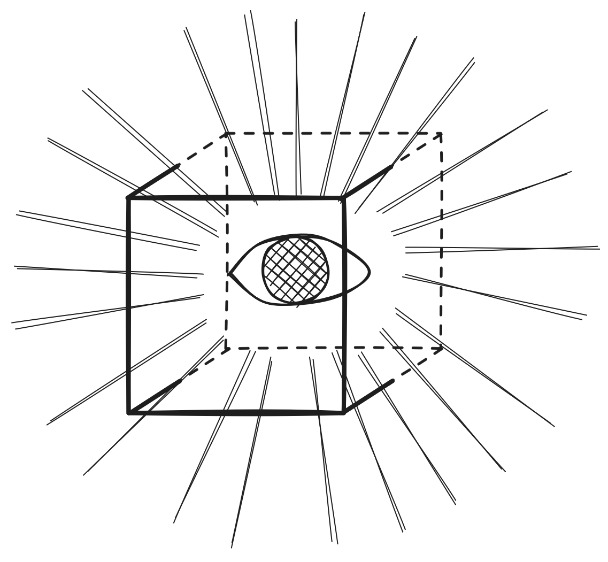
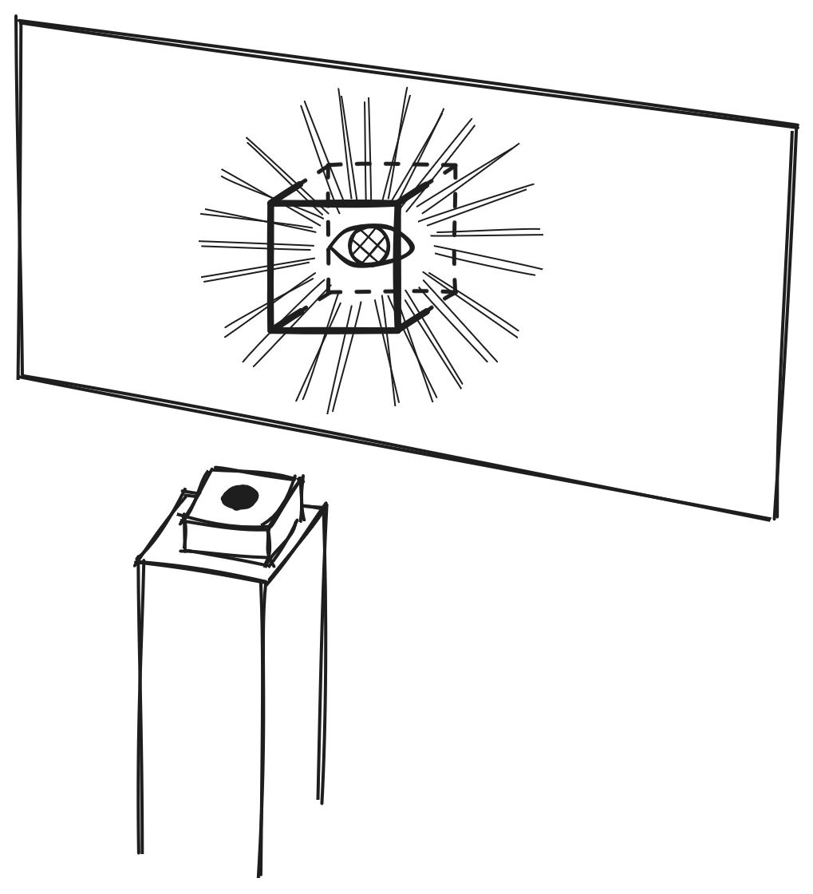

ispirata da un tatuaggio del mio amico giacomo:

ispirato alla filosofia del [solipsismo](solipsismo.md), che ha portato jay per un periodo a immaginarsi che tutto quello dietro di lui, fuori dal suo campo visivo, non esistesse e venisse costruito su misura ogni volta che viene osservato

il tatuaggio rappresenta un occhio dentro a un cubo, in cui i nove spigoli davanti sono linee solide, mentre i tre spigoli dietro sono tratteggiati, perché dietro all'occhio e fuori dal suo campo visivo.

illustrazioni con soggetto simile (le ho fatte io!)

## mia idea
un televisore, con dentro l'occhio e il cubo renderizzati in real time (ho in mente sempre questo stile bianco-nero con linee fatte finte a mano + shader foglio di carta) + una serie di altre illustrazioni dinamiche 

tramite una periferica hardware (una manopola? una leva?) lo spettatore può spostare l'occhio, e di conseguenza rendere solide o tratteggiate alcune linee

**Mael:**  
Io posso realizzare la parte Hardware, che oltre al joystick potrebbe pilotare dei led dietro al televisore che diano una specie di effetto di profondità, colorando in funzione dell'immagine visualizzata. Potremmo integrare un sistema che simuli questo effetto solipsista, dove i led cambiano a seconda di quale parte dell'immagine è visibile. L'idea sarebbe che, interagendo con il dispositivo, lo spettatore possa percepire una vera e propria "dinamicità" dell'immagine, spingendo oltre la semplice interazione visiva.  

**Proposta aggiuntiva:**  
Per aggiungere un ulteriore livello di immersione, potremmo anche pensare a come variare l'intensità dei led in base alla percezione dell'occhio spostato, così che l'ambiente sembri davvero modellarsi dietro di lui, influenzando direttamente l'esperienza visiva.
